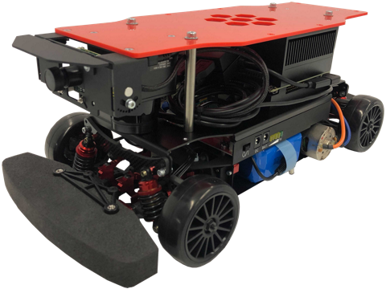
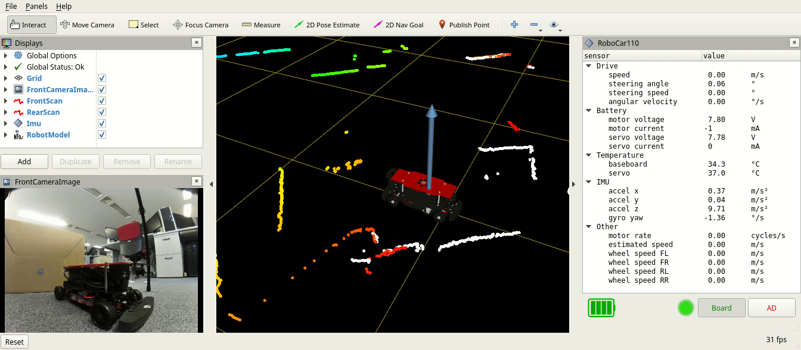
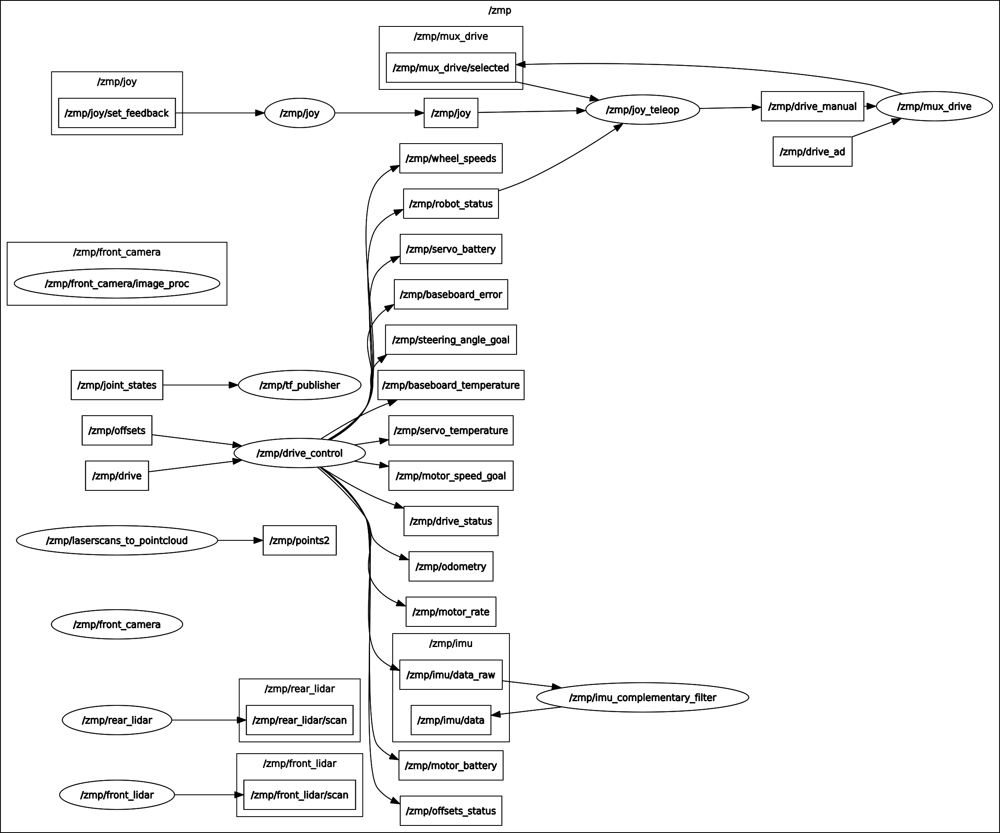
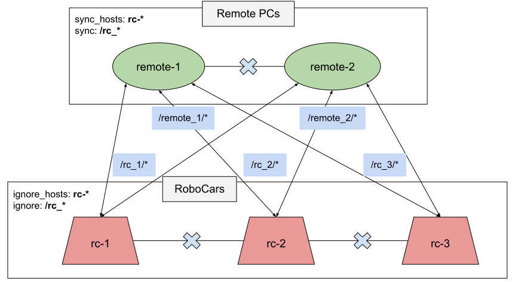

# RoboCar 1/10 X ROS

Here you can find a RoboCar 1/10 X ROS driver and sample nodes sources demonstrating its basic usage. 
Releases also contain binary C++ Base Drivers which are used by the ROS nodes.

The information about version changes can be found in [**ReleaseNotes**](ReleaseNotes.md).

[](https://www.zmp.co.jp/en/products/robocar/robocar-110x)

## Binary Packages [Robot Only]
Connect peripherals to the robot according to the User Manual. Boot, login, open browser, go to [**Releases**](https://github.com/zmp/robocar110_ros/releases) and download the latest `*.run` files.

Please, note that robot code works only on Nvidia AGX Xavier (arm64), Ubuntu 18.

### Base Drivers Installation
```
cd ~/Downloads
sh rc110_drivers_*.run
```

### ROS and RC110 Core + Robot Nodes Installation
```
sh rc110_robot_*.run
```

### System Check
Click on menu button and run "RoboCar 1/10" application.



## Source Code
### Fresh Installation
```
mkdir -p ~/ros/src
cd ~/ros/src
git clone https://github.com/zmp/robocar110_ros.git
```
```
cd ~/ros/src/robocar110_ros/  # make commands below are called from here!
```

* It's possible to use other directory (for example `~/projects/robocar110_ros/`), but it's not ROS standard way, so we don't provide support for it. Do it on your own risk.

### Version Update
* Please, check [**Update Instructions**](docs/UpdateInstructions.md). 
* And don't forget to apply [**Release Notes Actions**](ReleaseNotes.md)!

### Check Versions
```
make version
```

* **Tegra:** full operation system version string
* **JetPack (deb):** jetpack version installed from debian package
* **Base Driver:**   version of `rc110_drivers_*.run`
* **ROS Nodes:**     version of nodes listed in `rc110_robot_*.run`
* **Source Code:**   version of this source code

### Robot Nodes
For this, you need a real RoboCar 1/10X. If you don't have one, try simulation described below.

* [**ROS Installation**](docs/RosInstallation.md)
* [**Robot Sources**](rc110_robot/README.md)



### Remote Connection
Automatic remote connection to the robot is possible from Ubuntu OS. The ROS version should be the same as on robot. Tested architectures: amd64, arm64.

* [**ROS Installation**](docs/RosInstallation.md)
* [**Remote Connection**](docs/RemoteConnection.md)



### Gazebo Simulation
It's possible to do simple tests without robot in simulated environment. There's no need to build driver and system service packages. Tested architectures: amd64, arm64.

* [**ROS Installation**](docs/RosInstallation.md)
* [**Simulation Sources**](rc110_simulation/rc110_gazebo/README.md)


### Other Samples
When the driver is up and running, it's possible to start other ROS nodes that communicate with it.

| Group                                              | Description                   |
|:---------------------------------------------------|:------------------------------|
| [**rc110_navigation**](rc110_navigation/README.md) | SLAM and Navigation           |
| [**rc110_perception**](rc110_perception/README.md) | Object Detection, etc         |

## Additional Information

* [**Windows Support**](docs/Windows.md)
* [**Make Commands Explanation**](docs/Makefiles.md)
* [**Details about Nodes Build**](docs/BuildDetails.md)
* [**Details about Runtime**](docs/RuntimeDetails.md)
* [**Multiple Robot Setup**](docs/MultiRobot.md)
* [**Contribution Guidelines**](docs/CONTRIBUTING.md)

## Discussions
It's possible to ask a question, propose an idea or just show your work at [**Discussions**](https://github.com/zmp/robocar110_ros/discussions). Please, feel free to use japanese language, we will add translation to your message, if we consider it helpful for the community.

The benefit of Discussions is that you can get a feedback not only from the company stuff, but also from robot users who might give even better ideas.
