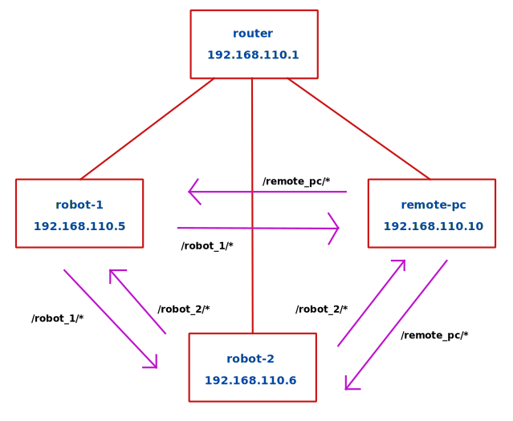

# Multiple Robot Setup
## Problem

By default, ROS1 uses only one tool ([**roscore**](http://wiki.ros.org/roscore)) to communicate between robots and user applications. The network setup can be described as follows:

* Robot with **roscore**
    * ROS_IP=192.168.x.x
* Remote PC
    * ROS_IP=192.168.y.y
    * ROS_MASTER_URI=http://192.168.x.x:11311/
* Robot2
    * ROS_IP=192.168.z.z
    * ROS_MASTER_URI=http://192.168.x.x:11311/

As you can see, adding more robots makes this construction quite fragile, because everything stops working once machine with roscore breaks.

Another downside of this - user needs a DNS server or to setup ip addresses manually.

## Solution for ROS1

Instead of having only one roscore, each machine can have its own roscore which is synchronized with others. The toolset we use for this is [**FKIE Multimaster**](https://github.com/fkie/multimaster_fkie).

It allows
1. To automatically detect other machines using [**zeroconf**](https://en.wikipedia.org/wiki/Zero-configuration_networking).
2. To synchronize `rosmaster` part of `roscore` (nodes, topics and services).
3. To manage the system in GUI ([**Node Manager**](https://fkie.github.io/multimaster_fkie/node_manager.html)).

## Zeroconf Setup

The zeroconf implementation for Linux is called [**Avahi**](https://en.wikipedia.org/wiki/Avahi_(software)).

If you use only one robot, we recommend to leave `hostname` as `zmp`, because it's hardcoded in some configuration files.

For other robots, it must me changed as follows (dashes are allowed, underscores are not):
```shell
sudo nano /etc/hostname # robot-name
sudo nano /etc/hosts    # 127.0.1.1  robot-name
sudo reboot
```

After that, some configurations maybe need to be updated (RViz for example).

Additionally, Avahi itself can be configured:
```shell
sudo nano /etc/avahi/avahi-daemon.conf
sudo systemctl restart avahi-daemon
```

**Known Issue:** [.local domain gets suffix "-2" sometimes](https://github.com/lathiat/avahi/issues/117).
* It can happen when network changes from one router to another. To resolve it manually, please, restart the avahi-daemon as written above.

## Namespaces Setup
Multiple robot setup requires names of nodes, topics, services and parameters to be prefixed with unique identifier to avoid names collision. Usually robot/machine name is used for this purpose (dashes changed to underscores).

For example with `ROS_NAMESPACE=/robot_name`, instead of `/front_lidar/scan`, the topic will be called `/robot_name/front_lidar/scan`.

[**ROS Transforms**](http://wiki.ros.org/tf2) also need to be prefixed, but unfortunately it is not affected by `ROS_NAMESPACE` variable. So we need to prefix each `frame_id` manually.

In contrast to ros namespace, frame id **must not** start with slash (`/`). Also note that separator for prefix is designed to be **only slash**, because it is used with `tf_prefix` parameter.

For example, instead of `base_link`, the frame id will be called `robot_name/base_link`.

## Synchronization Setup
In order to synchronize nodes, we need to provide `ROS_HOSTNAME` and `ROS_MASTER_URI` variables. You can check the way it is done in [**the script**](../rc110_core/rc110/devel/ns_hostname.bash). Note, that `ROS_IP` is not needed anymore.

The configuration for namespaces and synchronization is applied automatically for `make` commands. But you can still run it manually from terminal:
```shell
source $(catkin locate --devel)/ns_hostname.bash
```

## Notes about Synchronization
ROS Master is synchronized for all nodes except synchronizer nodes themselves and nodes on local machine that start with `/<robot_name>` prefix.


