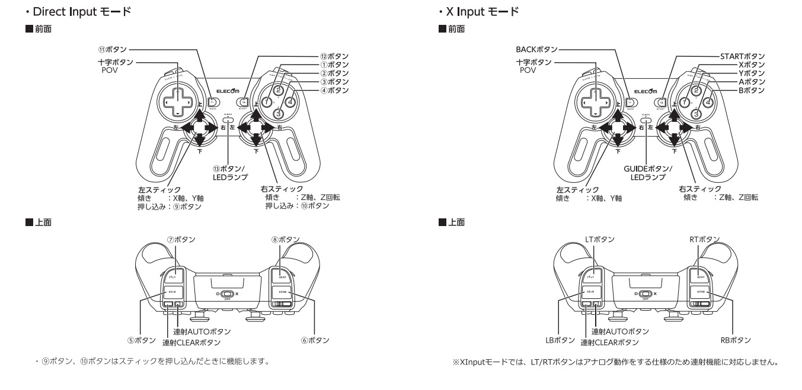

# RoboCar 1/10 Teleoperation

## Joystick Connected to Robot
Nodes are launched by default for it. Please, check the user manual if you have any troubles.

## Joystick Connected to Remote PC
Connect joystick dongle to your remote PC instead of robot:
```
cd ~/ros/src/robocar110_ros

make deps-teleop
make teleop
make run-teleop
```

Connect other joystick to remote PC:
```
make run-teleop device=1  # ls /dev/input/js*
```

Other arguments:
```
make run-teleop joy_type=logicool     # force joystick type
make run-teleop rc=rc_12345           # set robot and disable switch
```

## Mouse Remote Operation
If you want to move the robocar from remote PC by mouse, do the following:
```
cd ~/ros/src/robocar110_ros

make deps-teleop
make teleop
make mouse-teleop
```  

## Controls

- [Details of the Joystick](https://www.elecom.co.jp/products/JC-U4113SBK.html)


- Button 5: press and hold it to drive
- Button 6: switch to next robot (remote PC only)
- Button 7: increases gear (gear 1 on start)
- Button 8: decreases gear
- Button 11: enable/disable baseboard
- Button 12: enable/disable AD
- Axis 9:  up and down regulates speed
- Axis 10: changes steering angle

**Note:** AUTO and CLEAR buttons are not mapped by ROS driver.

#### Default Gears

* `r: -0.3` is -30% of max accel
* `1: +0.3` is 30% of max accel
* `2: +0.6` is 60% of max accel
* `3: +1.0` is 100% of max accel

Where max accel can be configured as `accel` axis (see below).

Be careful of putting high values, because the car is not designed for crashing.

## Remapping

To know buttons and axes indexes, use `rostopic echo /$(hostname | tr - _)/joy`. Indexes start from 0.

Buttons mapping is set in `rc110_core/rc110_teleop/config/joy_<type>.yaml`.
* `steering` and `accel` axes can have additional parameters:
    * `<axis>: [index, max, min]`
    * if they are not specified, default values are assigned
    * if `min` is not specified, it equals `-max`
    * if `min` is greater than `max`, axis is inverted
* For lever type of joystick, `steering_aux` parameter is used which allows more precise control.

## Joy Teleop Node Description
### Subscribed Topics
```
joy [sensor_msgs::Joy]
    topic from joy node
    
robot_status [rc110_msgs::Status]
    Status of baseboard, drive and steering motors

mux_drive/selected [std_msgs::String]
    selected drive topic (AD / Manual)
```

### Parameters
```
~/rc (string, default: zmp)
    fixed robot name (if any)
    
~/frame_id (string, default: joy)
    output frame id

~/gears (double[], default: [0.3, 0.6, 1.0])
    gears speed (m/s)
    Please, be careful with high speed!

~/rate (double, default: 30.0)
    output update rate

~/joy_path (string, default: "")
    path of the device (used for joystick autodetection)

~/joy_type (string, default: "")
    joystick type (available types can be found in config/)
```