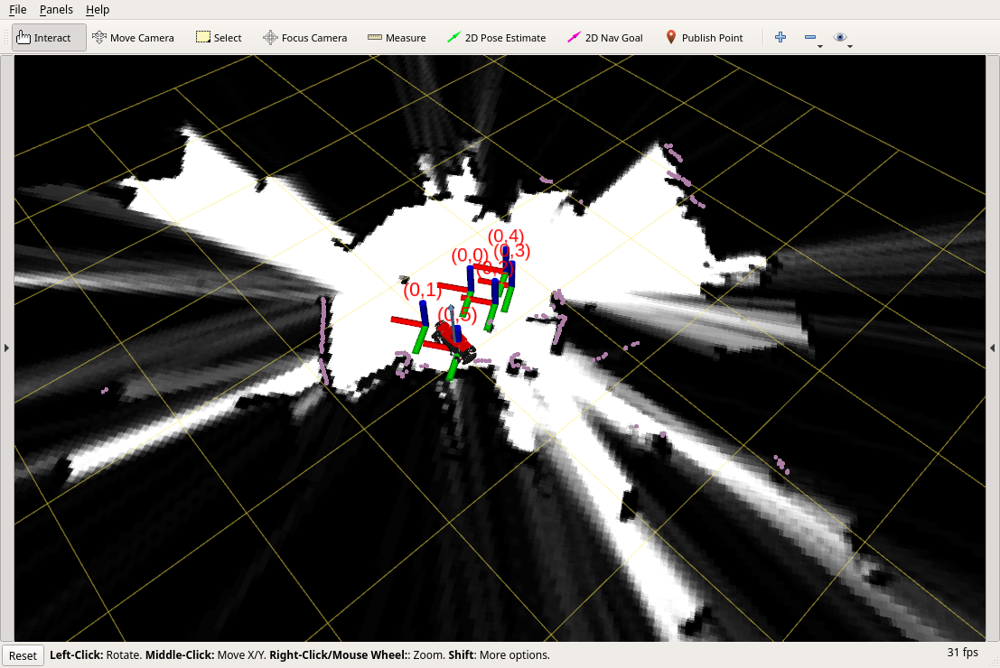

# SLAM with Google Cartographer

Current configuration allows creating a map basing on 2D lidar.

## UI


## Google Cartographer
#### Project repo
* https://github.com/cartographer-project/cartographer

#### Documentation
* https://google-cartographer-ros.readthedocs.io/en/latest/

## Makefile
```
make deps         # check dependencies
make              # build
make run          # run slam node
make show         # show rviz
make monitor      # show rviz on remote pc
```

## Mapping
* Build and run slam as written above.
* Then drive robot around slowly with joystick.
* You should see a map and localization points.
