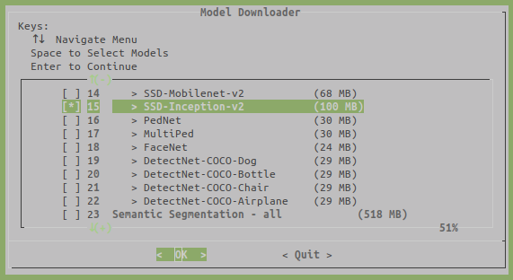

# RoboCar 1/10 ROS nodes for deploying deep learning detection models #
***

## Dependencies ##
***

- [x86 Specific Dependencies](docs/dependencies_installation_x86.md) (not needed on robot)
- [Jetson Inference Library](https://github.com/dusty-nv/jetson-inference):

```bash
export JETSON_INFERENCE_DIR="$HOME/.cache/rc110"
export JETSON_INFERENCE_VERSION="L4T-R32.5.0"

mkdir -p $JETSON_INFERENCE_DIR && cd $JETSON_INFERENCE_DIR
git clone -b $JETSON_INFERENCE_VERSION --recursive https://github.com/dusty-nv/jetson-inference
cd jetson-inference
mkdir build && cd build && cmake ../
make -j
sudo make install
sudo ldconfig
```

* During cmake step of installation, please, select model 15 and disable others, as on the following image:



## Usage ##
***

```
make deps         # check dependencies
make              # build
make run          # roslaunch (see below)
make show         # show overlay image in rviz
make monitor      # same on remote pc
```

**RosLaunch**
```bash
roslaunch rc110_object_detection rc110_object_detection_node.launch

# or launch with rviz
roslaunch rc110_object_detection rc110_object_detection_node_rviz.launch
```

- The first time you launch the node, it will start the build of tensorrt's runtime engine, so it will take a little while ONLY for this first time.

## Subscribed Topics ##
***

```text
~/input_image [sensor_msgs:Image]
    input image message
```

## Published Topics ##
***

```text
/rc110_object_detection_node/classes_info [rc110_msgs:StringArray]
    info about the dataset classes

/rc110_object_detection_node/detections [vision_msgs:Detection2DArray]
    detected 2d bounding boxes

/rc110_object_detection_node/overlay [sensor_msgs:Image]
    debug result image with overlaid bounding boxes
```

## Parameters ##
***

```text
confidence_thresh (float, default: 0.6)
    threshold of confidence score of the detection network.
    confidence score is the probability that a bounding box contains an object.

model_path (string)
    absolute path to model weights

class_labels_path (string)
    absolute path to the labels file

overlay_str (string, default: box,labels,conf)
    contents that will be drawn on overlaid debug image

input_blob (string, default: Input)
    name of the input layer blob

output_blob (string, default: NMS)
    name of the output layer blob containing the bounding boxes

output_count (string, default: NMS_1)
    name of the output layer blob containing the detection count

num_channels (int, default: 3)
    number of channels of the network input

input_height (int, default: 300)
    height of the network input

input_width (int, default: 300)
    width of the network input
```

# Additional Info #
## Models Download ##
***

Models download can be started after build with a different command:

```bash
cd $JETSON_INFERENCE_DIR/jetson-inference/tools
./download-models.sh
```

* The models are saved in
    - `$JETSON_INFERENCE_DIR/jetson-inference/data/networks/SSD-Inception-v2`
* There are two files in the directory:
    1. `ssd_coco_labels.txt` (label file)
    2. `ssd_inception_v2_coco.uff` (weights file)

# References #
***

- [Jetson Utils](https://github.com/dusty-nv/jetson-utils)
- [Jetson Inference Library](https://github.com/dusty-nv/jetson-inference)
- [Deep Learning Nodes for ROS/ROS2](https://github.com/dusty-nv/ros_deep_learning)
