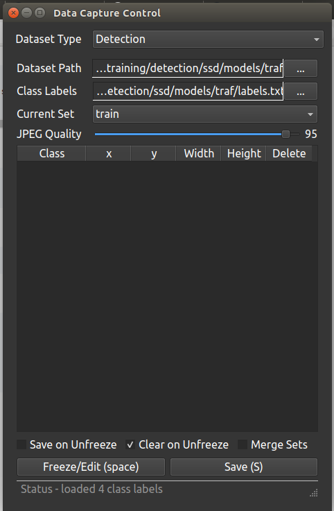

Go to `jetson-inference/python/training/detection/ssd/data` and create an empty directory to store the dataset and a text file to define the class labels.

Stop robocar movement with:   
```
$ cd ros/src/robocar110_ros/ 
$ make stop
```

Open a new terminal and type the following command to start the camera.  
```
$ camera-capture /dev/video0   # using V4L2 camera /dev/video0
```

When Data Capture Control is opened, change Dataset Type to Detection, and link Dataset Path and Class label to the ones you created above. 
[](https://www.zmp.co.jp/en/products/robocar/robocar-110x) 

Make sure that the object is within the frame of the camera, and press the Freeze/Edit button (or the space key) to freeze the image and draw a bounding box on the image. 
[](https://www.zmp.co.jp/en/products/robocar/robocar-110x) 

Labeling the image by selecting the appropriate object class for each bounding box. After labeling is finished, click the Freeze/Edit button to save the data and release freeze for the next labeling.

Once you have enough data, create an empty directory in `jetson-inference/python/training/detection/ssd/models` (e.g. directory name: training) and move each image data and the text files defining the class labels. 

Please, check that you have `train_ssd.py` file in `jetson-inference/python/training/detection/ssd` directory. Do the following if not:  
```
$ git submodule update https://github.com/dusty-nv/pytorch-ssd
```

After installing the package, open a new terminal and type the following command to set up.  
```
$ cd jetson-inference/python/training/detection/ssd 
$ wget https://nvidia.box.com/shared/static/djf5w54rjvpqocsiztzaandq1m3avr7c.pth -O models/mobilenet-v1-ssd-mp-0_675.pth 
$ pip3 install -v -r requirements.txt
```

Then, open a new terminal and train the model using train_ssd.py.  
```
$ cd jetson-inference/python/training/detection/ssd 
$ python3 train_ssd.py --dataset-type=voc --data=data/<YOUR-DATASET> --model-dir=models/<YOUR-MODEL>
```

After training, the PyTorch model needs to be converted to Onnx data.  
```
$ python3 onnx_export.py --model-dir=models/<YOUR-MODEL>
```

The converted model will be saved as <YOUR-MODEL>/ssd-mobilenet.onnx and can be loaded by entering the following command.  
```
NET=models/<YOUR-MODEL>

detectnet --model=$NET/ssd-mobilenet.onnx --labels=$NET/labels.txt \ 
          --input-blob=input_0 --output-cvg=scores --output-bbox=boxes \  
            /dev/video0
```

Referenced URLs  
https://github.com/dusty-nv/jetson-inference/blob/master/docs/pytorch-collect-detection.md  
https://github.com/dusty-nv/jetson-inference/blob/master/docs/pytorch-ssd.md


