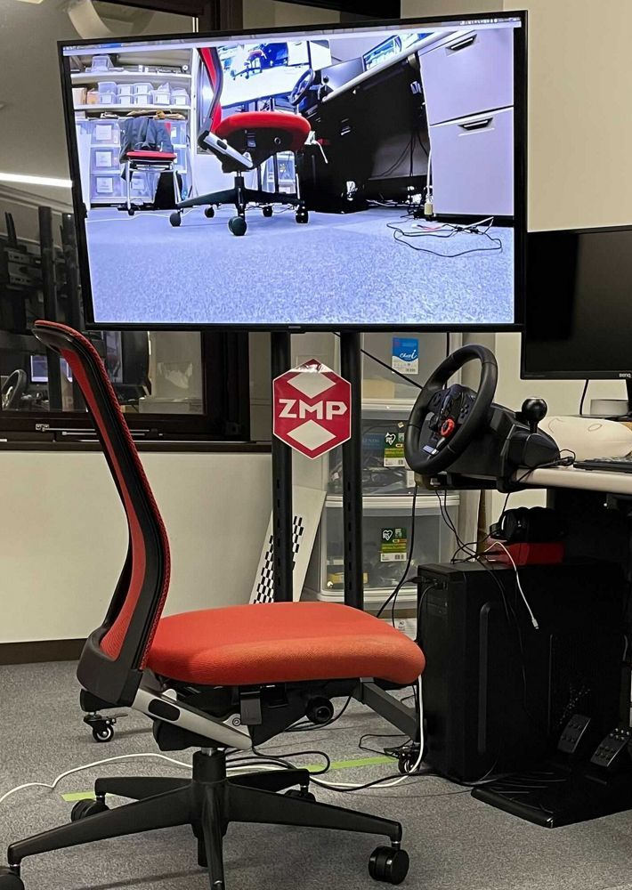
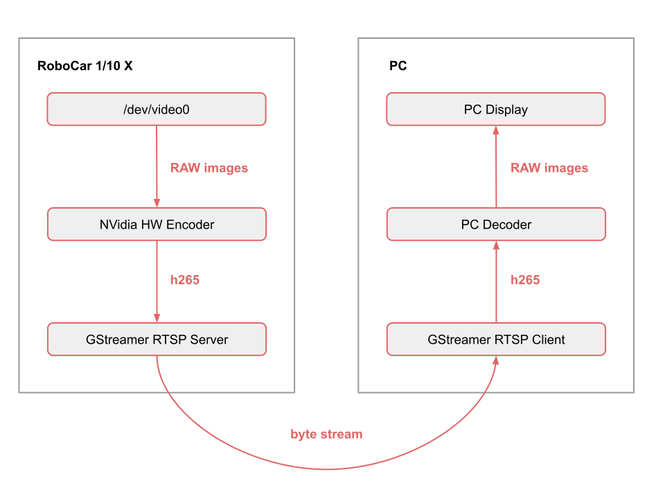

# Simple RTSP Video Server

A sample of streaming h265 over network.

Depends on **gstreamer-rtsp-server** ( **GPL3** ).
* https://github.com/GStreamer/gst-rtsp-server



## Pipeline Scheme



* [NVidia HW Encoder](https://developer.nvidia.com/nvidia-video-codec-sdk)

## Makefile
```
make deps            # check dependencies
make                 # build
make run             # run streaming on robot in VGA resolution
make run r=vga       # same (other values: hd, sxga, fhd, qhd)
make show            # playback the stream
```
`make show` has the following options:

* `rc=zmp` - show camera from robot named `zmp`
* `overlay=on` - FPS overlay (only remote) (can crash with SIGSEGV)

URL to playback video stream with GUI application like VLC: `rtsp://rc-one.local:8554/front`

## Parameters

```
debug_level (int, default: 1)
    debug level: 0 - no debug, 4 - max debug

port (string, default: "8554")
    RTSP port

url_suffix (string, default: front)
    device specific url suffix: rtsp://<>/front

gst_args (string, default: "")
    arguments for gst-launch (please, see the yaml for details)
```

## Additional Info

### Test Results
For 1920x1080, 60fps:

* Throughput: < ~700 KB/s
* LAN Lag: < ~200 ms
* CPU Load: ~15% (1 core)
