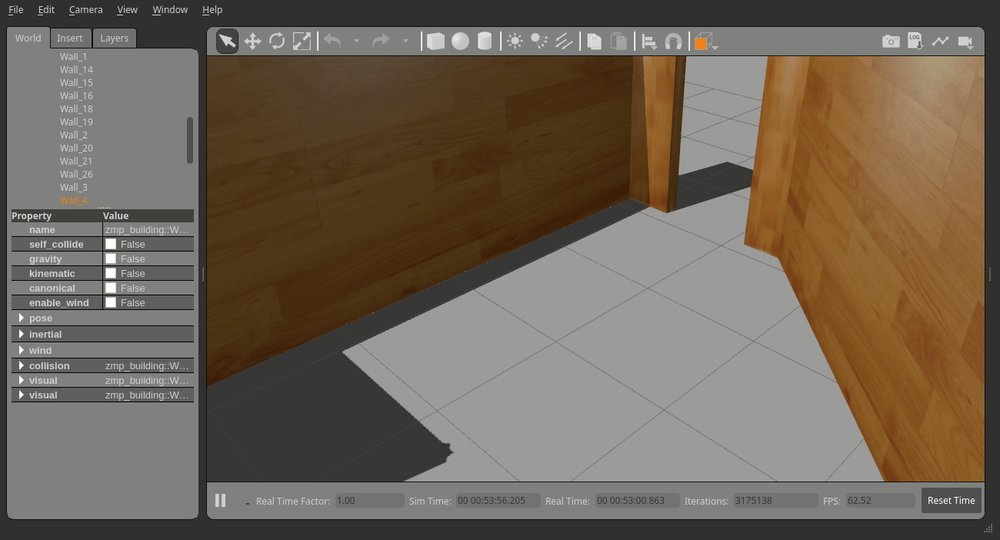

# RC 1/10 Gazebo Simulation Sample

This package contains components for simulation of RC 1/10 in Gazebo with drive control functionality and sensors output using open-source Gazebo ROS plugins.

* Conversion of RC 1/10 AckermannDrive message to Twist message that is supported by the Gazebo Model plugin.
* Publishing information similar to **rc110_drive_control**.

## UI


## Makefile

```
make deps         # check dependencies
make              # build
make run          # run simulation  (If it's run on robot, from robocar110_ros/, please, run: make stop) 
make show         # show rviz  (At first from robocar110_ros/, you need to run: make rviz)

make run use_gui:=false    # run without gazebo gui
```

## Subscribed Topics

```
/drive [ackermann_msgs::AckermannDriveStamped ]
    input ackermann drive message
```

## Published Topics

```
/drive_twist [geometry_msgs::Twist]
    ackermann drive converted to twist message
```

## Custom World
### Building From Scratch
* See the official tutorial: http://gazebosim.org/tutorials?cat=build_world&tut=building_editor
* Roslaunch parameter for custom world: `make run world:=/absolute/path.world`
* Or `make run root:=/world/root world:=relative/path.world`
    * Latter also adds models from `${root}/models`

### Using Ready-Made Worlds
* Please, refer to [**gazebo_world_switching.md**](docs/gazebo_world_switching.md).

## Issues

* `gazebo died from signal 9` or `[gazebo-5] escalating to SIGTERM`
    * Gazebo bug: https://github.com/ros-simulation/gazebo_ros_pkgs/issues/751

* `[Err] [OpenAL.cc:84] Unable to open audio device[default]`
    * Few seconds delay on virtual pc due to lack of sound card.
    * Sometimes it does not cause delay.

* `[Err] [ModelDatabase.cc:390] Unable to parse model.config for model`
    * Workaround: `export GAZEBO_MODEL_DATABASE_URI=" "`
    * See: https://github.com/osrf/gazebo/issues/2934
    * You'll get instead: `[Wrn] [ModelDatabase.cc:212] Unable to connect to model database using [ //database.config].`

* `[Wrn]` prefixed messages can be ignored probably.
